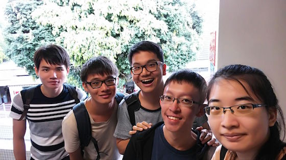
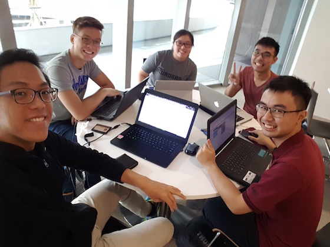
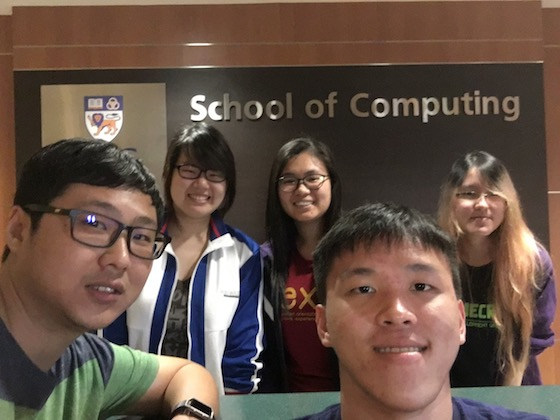
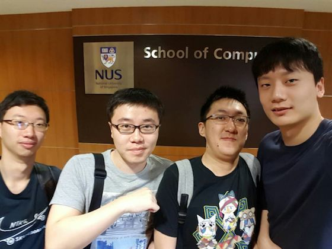
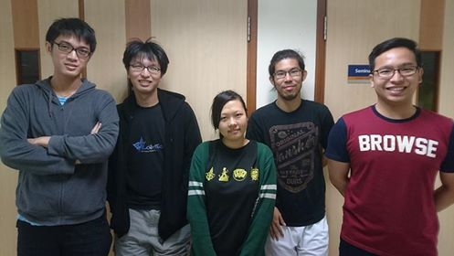

<h1 id="teams">Teams</h1>

<h3 id="lezzgo">Lezzgo</h3>

<table><tr><td valign="top">
	
	</td><td valign="top">
	
Project: <a href="https://github.com/nus-mtp/another-cs-study-planner">CS Study Planner</a>

	<ul>
		<li><a href="https://github.com/nlzz22">Lam Zhen Zong, Nicholas</a></li>
		<li><a href="https://github.com/tgqiang">Tay Guo Qiang</a></li>
		<li><a href="https://github.com/helloqx">Teo Qi Xuan</a></li>
		<li><a href="https://github.com/a0129998">Wu Xiaoxiao</a></li>
		<li><a href="https://github.com/xaterz">Yu Ruofan</a></li>
	</ul>
</td></tr></table>

<h3 id="rainbowhead-studios">Rainbowhead Studios</h3>

<table><tr><td valign="top">
	
</td><td valign="top">

Project: <a href="https://github.com/nus-mtp/cs-study-planner">CS Study Planner</a>

<ul>
	<li><a href="https://github.com/IamVacer">Adrian Chan Ee Ray</a></li>
	<li><a href="https://github.com/Satrio1610">Antonius Satrio Triatmoko</a></li>
	<li><a href="https://github.com/bsweeyee">Brandon Swee Yee</a></li>
	<li><a href="https://github.com/NatashaKSS">Natasha Koh Sze Sze</a></li>
	<li><a href="https://github.com/walrys">See Wenhan</a></li>
</ul>
</td></tr></table>

<h3 id="shashimi">Sashimi</h3>

<table><tr><td valign="top">
	
</td><td valign="top">

Project: <a href="https://github.com/nus-mtp/lecture-note-2.0">Lecture Note 2.0</a>

<ul>
	<li><a href="https://github.com/tayjiehao">Tay Jie Hao</a></li>
	<li><a href="https://github.com/tharain">Won Jun Ru Daphne</a></li>
	<li><a href="https://github.com/jiayingy">Lek Jia Ying</a></li>
	<li><a href="https://github.com/amoshydra">Amos Wong Wen Jet</a></li>
	<li><a href="https://github.com/chuajiaxuan">Chua Jia Xuan</a></li>
</ul>
</td></tr></table>

<h3 id="elegant-owls">elegant-owls</h3>

<table><tr><td valign="top">
	
</td><td valign="top">

Project: <a href="https://github.com/nus-mtp/bill-organizer">Bill Organizer</a>

<ul>
	<li><a href="https://github.com/chaejinkeyne">Charlene Lee Kei Xin</a></li>
	<li><a href="https://github.com/lmxn">Lim Xin Ai</a></li>
	<li><a href="https://github.com/eatedcookie">Tan Yan Ling</a></li>
	<li><a href="https://github.com/TeddyHartanto">Teddy Hartanto</a></li>
	<li><a href="https://github.com/dev-seahouse">Xin Kenan</a></li>
</ul>
</td></tr></table>

<h3 id="team-pigeon">Team Pigeon</h3>

<table><tr><td valign="top">
	
</td><td valign="top">

Project: <a href="https://github.com/nus-mtp/movie-pigeon">Movie Pigeon</a>

<ul>
	<li><a href="https://github.com/Carl26">Guo Mingxuan</a></li>
	<li><a href="https://github.com/shadowsong27">Song Yikun</a></li>
	<li><a href="https://github.com/Sheng-Xuan">Sheng Xuan</a></li>
	<li><a href="https://github.com/zzzzwen">Song Zhiwen</a></li>
</ul>
</td></tr></table>

<h3 id="xorcerers">Xorcerers</h3>

<table><tr><td valign="top">
	
</td><td valign="top">

Project: <a href="https://github.com/nus-mtp/steps-networking-module">STePS Networking Module</a>

<ul>
	<li><a href="https://github.com/ycewe">Eric Ewe Yow Chong</a></li>
	<li><a href="https://github.com/JeanKoh">Koh Ling Ling Jean</a></li>
	<li><a href="https://github.com/Vylantze">Lai Zhin Hou Darryl</a></li>
	<li><a href="https://github.com//Muhammad-Adam">Muhammad Adam Bin Ismail</a></li>
	<li><a href="https://github.com/Sean-Tay">Tay Siang Meng Sean</a></li>
</ul>
</td></tr></table>

<h3 id="soloq">SOLOQ</h3>

<table><tr><td valign="top">
	
</td><td valign="top">

Project: <a href="https://github.com/nus-mtp/e-tutorial">e-Tutorial</a>

<ul>
	<li><a href="https://github.com/yeojoey">Yeo Joey</a></li>
	<li><a href="https://github.com/silfer">Goh Yuan Tat</a></li>
	<li><a href="https://github.com/glutSolidSphere">Lim Weizheng</a></li>
</ul>
</td></tr></table>
